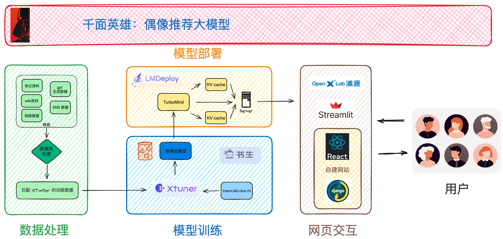

# 千面英雄

## 简介
人类作为适应地球最成功的生物，其最伟大的能力是心想事成，只要也唯有敢想，我们才能将高楼大厦拔地而起，将人送到太空，制造出原子弹、核电站，让 AI 进化出智能。敢想是人类进化至今的第一推动力。

人工智能的奇点越来越近，世界随时可能发生翻天覆地的变化，敢想让你有为。
经济、技术行业的周期性变化，让许多人生活在低谷之中，敢想让你翻身。

最让人敢想的是偶像英雄们的激励，在低谷时敢想不放弃，在进取时敢想能开阔创新。唯有被偶像激励的敢想，才能让人咬牙坚持，在黑夜中坚信众人未见的黎明，我上我也行。从《荷马史诗》到《马斯克传》传承千年的是对英雄的敬仰。这类产品过去存在，未来也会存在，因为这源于人类最根本的对故事性的需求。

千面英雄，利用时代最新的大模型技术，基于书生浦语大模型生态（InternalLM 1.8B 模型，利用 XTunner 微调，LMDeploy 部署），提供对话的形式，基于用户的价值观、兴趣、想要的成就、成长经历，个性化地推荐最契合用户的英雄偶像。让活生生的人和经历激励你，让你不拍摔倒，敢想，敢干的同时也能深刻意识到世界的复杂和交换成功所要付出的代价。目前将专注于 IT 领域的偶像推荐，后续会扩展更多领域，并提供和聚合关于偶像更多的资料(传记、文稿、采访视频、名言)，最终打造一个社区，在这个社区里用户能分享自己的偶像、添加更多偶像的资料和分享自己的故事。在个人 IP 越来越重要的今天，偶像相关的产品也越发值得探索。

## 架构图

## 项目阶段划分
* 阶段一：集中优化模型，提供 IT 领域的偶像英雄推荐
* 阶段二：开发前后端以 SaaS 方式提供服务
* 阶段三：提供和聚合关于偶像更多的资料(传记、文稿、采访视频、名言)
* 阶段四：扩展推荐领域
* 阶段五：开放社区，鼓励用户创造更多高质量内容

## 关于偶像、英雄的名言
> "桃李不言，下自成蹊。" ——《后汉书》

>  "A hero is no braver than an ordinary man, but he is brave five minutes longer." — Ralph Waldo Emerson
>  英雄并不比普通人更勇敢，但他可以多勇敢 5 分钟。  ——拉尔夫·沃尔多·爱默生

> It is not the critic who counts; not the man who points out how the strong man stumbles, or where the doer of deeds could have done them better. The credit belongs to the man who is actually in the arena, whose face is marred by dust and sweat and blood; who strives valiantly; who errs, who comes short again and again, because there is no effort without error and shortcoming; but who does actually strive to do the deeds; who knows great enthusiasms, the great devotions; who spends himself in a worthy cause; who at the best knows in the end the triumph of high achievement, and who at the worst, if he fails, at least fails while daring greatly, so that his place shall never be with those cold and timid souls who neither know victory nor defeat." — Theodore Roosevelt
> 重要的不是那些批评家，不是那些指出强者跌倒或行动者本可以做得更好的人。荣誉属于那些真正在竞技场上的人，他们的脸上沾满了尘土、汗水和鲜血；他们勇敢地奋斗；他们犯错误，一次又一次地失败，因为没有任何努力是无误和无缺陷的；但他们确实努力去做；他们知道伟大的热情，伟大的奉献；他们在一个值得的事业中投入自己；在最好的情况下，他最终知道伟大成就的胜利，而在最坏的情况下，即使他失败了，至少他敢于大胆尝试，这样他的位置永远不会与那些既不知道胜利也不知道失败的冷漠和胆怯的灵魂在一起。——西奥多·罗斯福

